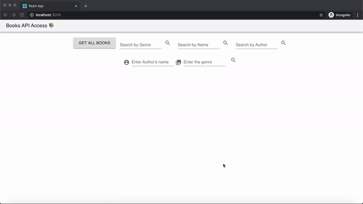

## React-Node-Books-Api is developed with React-JS as Front-end and Node-Express JS as Back-end.

This directory has two directories : 
* front-end
* rest-api-docker

## Make sure you have node and docker installed on your machine before starting the project.

Head to the individual folders after cloning and follow the README.

### In the front-end directory : 

1) First install all the dependencies by running commands within this directory.
 ```bash
 npm install
 ```

2) To run use : 
```bash
npm start
```

### In the rest-api-docker directory : 

1) First install all the dependencies by running command within this directory.
 ```bash
 npm install
 ```

2) To run with docker use : 
```bash
docker run -it -p 9000:5000 -v $(pwd):/app node-rest-api
```

### Routes that are accessible to this server 

1. This route allows you to retrieve complete list of books from database.
```
http://localhost:9000/books
```
2. This route allows you to retrieve list of books associated with that book name.
```
http://localhost:9000/books/name/:name
```
3. This route allows you to retrieve list of books associated with that genre.
```
http://localhost:9000/books/genre/:genre
```
4. This route allows you to retrieve list of books associated with that book author.
```
http://localhost:9000/books/author/:author
```
5. This route allows you to retrieve list of books associated with that book author and genre.
```
http://localhost:9000/books/author/:author/genre/:genre
```



